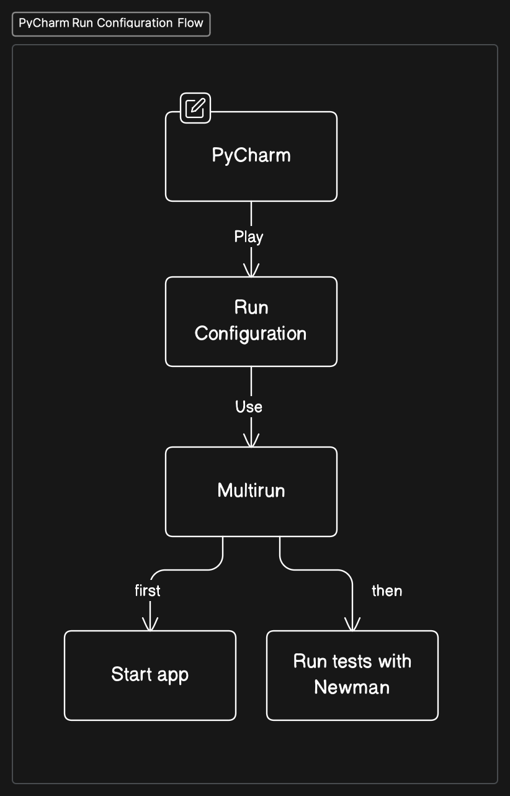
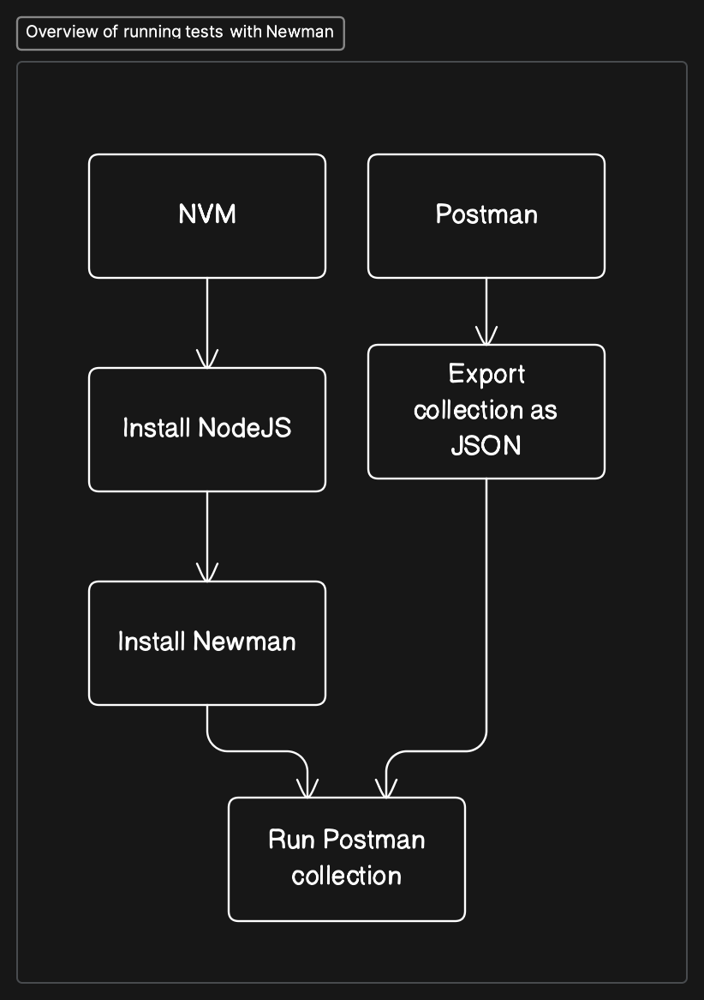

# System Testing with Postman and Newman

In this section, we learn about how to use Postman to write system tests, and how to run them in the command line with Newman.

Here's an overview of how the PyCharm Run Configuration flow goes:



## Windows-specific information

### Bash Support no longer needed

In the videos we use the **Bash Support** extension of PyCharm to interact with the command line. Specifically, we use it to create **Run Configurations** so that we can hit the "Play" button and that runs a command-line script.

This is no longer necessary, as PyCharm now ships with **Shell Script**. You can skip installing **Bash Support**, and where we use **Bash Support** in the videos, you can use **Shell Script**.

> **Key Takeaway**: don't use **Bash Support**, instead use the built-in **Shell Script**.

### Installing nvm (Node Version Manager)



In the videos we install Node Version Manager (nvm) to install a specific version of NodeJS. We use that to install Newman, which we can use to run Postman tests in the command line.

If you are using Windows, you'll want to install [nvm-windows](https://github.com/coreybutler/nvm-windows) instead. There's a Windows installer you can use: [github.com/coreybutler/nvm-windows/releases](https://github.com/coreybutler/nvm-windows/releases) . Download the `nvm-setup.exe`  file and execute it. Once it has finished installing, you'll be able to run `nvm`  in your `cmd.exe`  application.

Other alternatives include [nodeenv](https://github.com/ekalinin/nodeenv), [nodist](https://github.com/marcelklehr/nodist), or [nvs](https://github.com/jasongin/nvs).

There, you can see the available NodeJS versions by running:

```bash
nvm list available
```

Then you can install the latest LTS (Long-Term Support) version:

```bash
nvm install lts
```

Once installed, you can use:

```bash
nvm use lts
```

Then, install newman:

```bash
npm install newman
```

Finally, you'll need to know where the `newman`  executable has been placed. You can find out its location with this command:

```bash
where newman
```

Copy the path to the `newman`  executable, as you'll need it in PyCharm when you create a **Shell Script** Run Configuration. Use the path in the **Script text** field of the Run Configuration.

### Running newman from PyCharm

1. Enable the Shell Script Plugin by going into your Settings -> Plugins -> Shell Script.
2. Create a new Run Configuration by going to the top right dropdown, clicking it, and then clicking on "Edit Configurations..."
3. Create a new Run Configuration of type Shell Script and give it a name, such as "Run Newman tests"
4. Select "Script Text"
5. In the Script text field, type your path to newman followed by `run stores-rest-api.postman_collection.json` .
    1. **Important** if your path to newman contains spaces, then write it in this format: `& 'path to your newman'`
    2. The final value of the Script text field will be something like this: `& 'path to your newman' run stores-rest-api.postman_collection.json` .
6. Press OK

You can follow the videos as normal for using the Multirun Run Configuration to start the app and run the tests.
